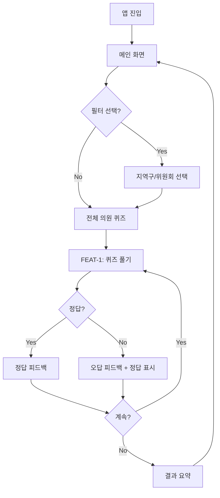
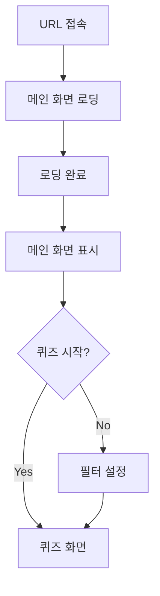
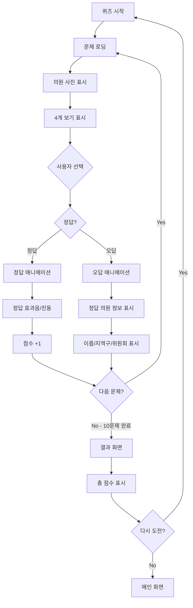
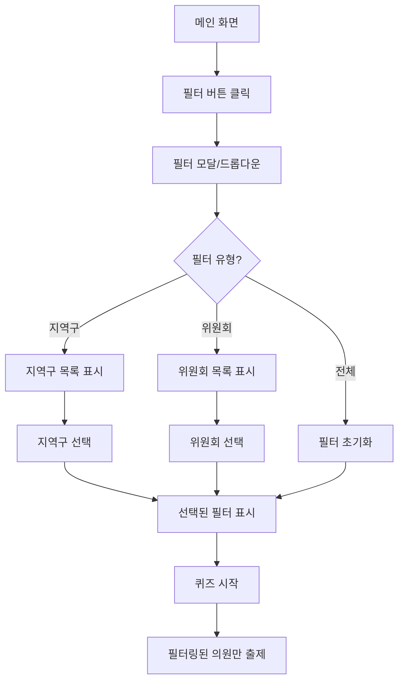
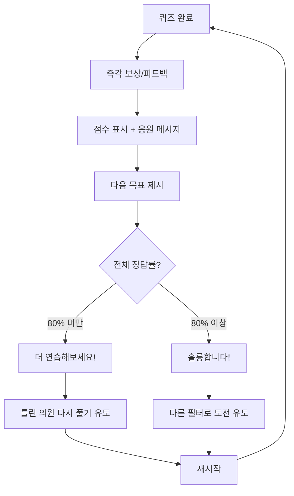
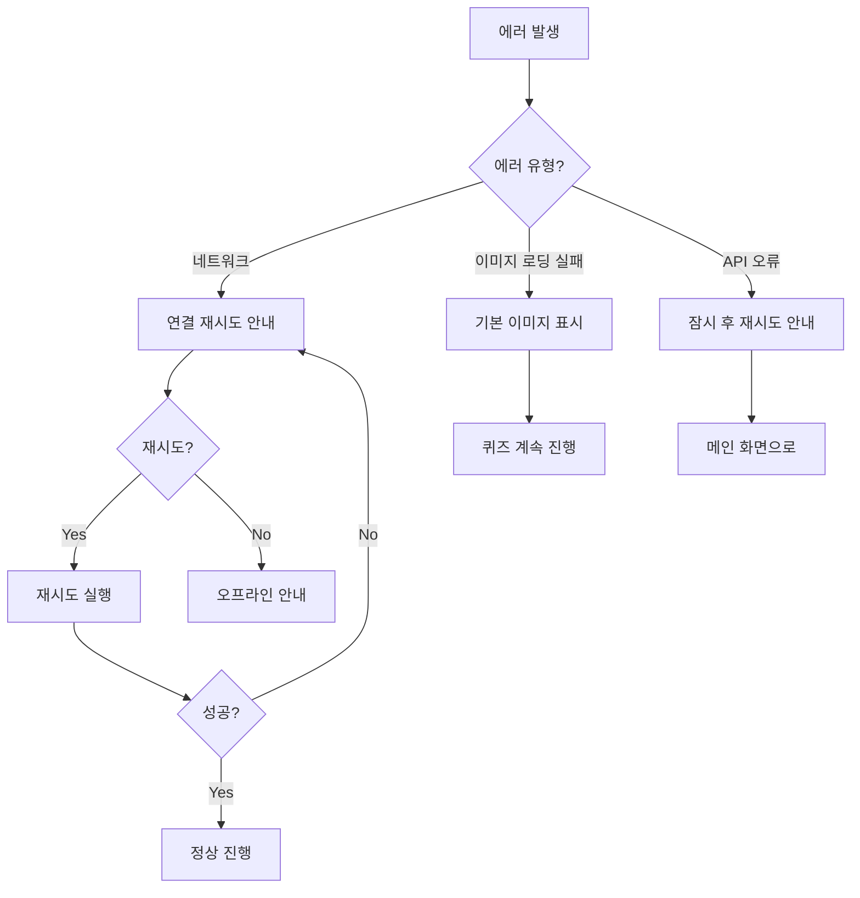

# User Flow (사용자 흐름도)

> Mermaid 플로우차트로 의원얼굴퀴즈의 핵심 여정을 표현합니다.

---

## MVP 캡슐

| # | 항목 | 내용 |
|---|------|------|
| 1 | 목표 | 경기도의회 직원이 의원 얼굴과 이름을 쉽고 재미있게 학습 |
| 2 | 페르소나 | 경기도의회 사무처 직원 (특히 신규 입사자) |
| 3 | 핵심 기능 | FEAT-1: 얼굴 보고 이름 맞추기 퀴즈 |
| 4 | 성공 지표 (노스스타) | 사용자가 전체 의원 정답률 80% 이상 달성 |
| 5 | 입력 지표 | 퀴즈 완료 횟수, 일일 활성 사용자 |
| 6 | 비기능 요구 | 모바일/PC 반응형 지원 |
| 7 | Out-of-scope | 로그인/회원가입, 학습 진도 저장, 랭킹 시스템 |
| 8 | Top 리스크 | 의원 사진 데이터 확보 및 최신 유지 |
| 9 | 완화/실험 | 경기도의회 공식 홈페이지 데이터 활용 |
| 10 | 다음 단계 | 의원 데이터 수집 및 정리 |

---

## 1. 전체 사용자 여정 (Overview)



---

## 2. FEAT-0: 진입 플로우 (로그인 없음)



**특징:**
- 로그인/회원가입 없음
- 바로 퀴즈 시작 가능
- 진입 장벽 최소화

---

## 3. FEAT-1: 얼굴 보고 이름 맞추기 퀴즈 플로우



---

## 4. 필터링 플로우



---

## 5. 리텐션 루프 (습관 형성)



---

## 6. 에러 처리 플로우



---

## 7. 화면 목록 (Screen Inventory)

| 화면 ID | 화면명 | FEAT | 진입점 | 주요 액션 |
|---------|--------|------|--------|----------|
| S-01 | 메인 화면 | - | URL 접속 | 퀴즈 시작, 필터 선택 |
| S-02 | 필터 선택 | FEAT-1 | S-01 | 지역구/위원회 선택 |
| S-03 | 퀴즈 화면 | FEAT-1 | S-01, S-02 | 보기 선택, 정답 확인 |
| S-04 | 결과 화면 | FEAT-1 | S-03 | 점수 확인, 재도전 |
| S-05 | 오답 상세 | FEAT-1 | S-03 | 정답 의원 정보 확인 |

---

## 8. 화면별 상세 설명

### S-01: 메인 화면

```
┌─────────────────────────────────┐
│         의원얼굴퀴즈            │
│                                 │
│    ┌─────────────────────┐     │
│    │                     │     │
│    │    [앱 로고/타이틀]  │     │
│    │                     │     │
│    └─────────────────────┘     │
│                                 │
│    [  전체 퀴즈 시작  ]         │
│                                 │
│    ───── 또는 ─────            │
│                                 │
│    [ 지역구 선택 ▼ ]            │
│    [ 위원회 선택 ▼ ]            │
│                                 │
│    [  선택 퀴즈 시작  ]         │
│                                 │
└─────────────────────────────────┘
```

### S-03: 퀴즈 화면

```
┌─────────────────────────────────┐
│  1/10              [X 나가기]   │
│                                 │
│    ┌─────────────────────┐     │
│    │                     │     │
│    │    [의원 사진]       │     │
│    │                     │     │
│    └─────────────────────┘     │
│                                 │
│    이 의원의 이름은?            │
│                                 │
│    ┌───────────┐ ┌───────────┐ │
│    │  홍길동    │ │  김철수   │ │
│    └───────────┘ └───────────┘ │
│    ┌───────────┐ ┌───────────┐ │
│    │  이영희    │ │  박민수   │ │
│    └───────────┘ └───────────┘ │
│                                 │
│    ────────────────────────    │
│    [진행바: ████████░░]        │
└─────────────────────────────────┘
```

### S-04: 결과 화면

```
┌─────────────────────────────────┐
│                                 │
│           🎉                    │
│                                 │
│       8 / 10 정답               │
│                                 │
│       정답률: 80%               │
│                                 │
│    "훌륭합니다!"                │
│                                 │
│    [  다시 도전  ]              │
│                                 │
│    [  메인으로  ]               │
│                                 │
└─────────────────────────────────┘
```

---

## Decision Log 참조

| 결정 | 이유 |
|------|------|
| 10문제 1세트 | 짧은 시간에 완료 가능, 부담 없이 학습 |
| 4지선다 | 적당한 난이도, 우연 정답 확률 25% |
| 즉각적 정답/오답 피드백 | 학습 효과 극대화 |
| 오답 시 정답 정보 표시 | 틀린 것 바로 교정 |
