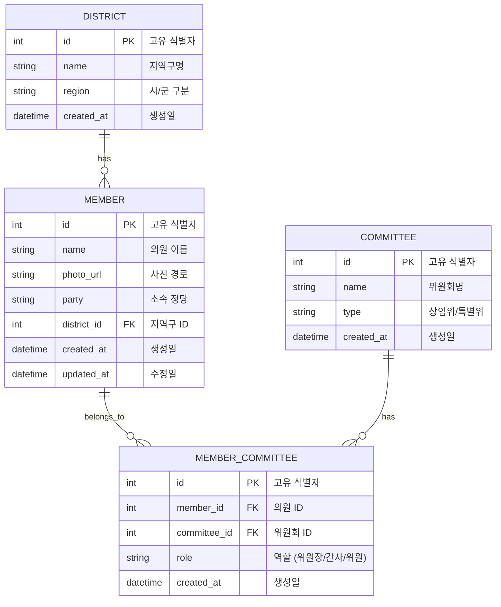
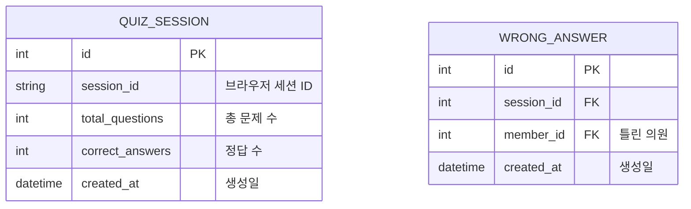

# Database Design (데이터베이스 설계)

> Mermaid ERD로 의원얼굴퀴즈의 데이터 구조를 표현합니다.

---

## MVP 캡슐

| # | 항목 | 내용 |
|---|------|------|
| 1 | 목표 | 경기도의회 직원이 의원 얼굴과 이름을 쉽고 재미있게 학습 |
| 2 | 페르소나 | 경기도의회 사무처 직원 (특히 신규 입사자) |
| 3 | 핵심 기능 | FEAT-1: 얼굴 보고 이름 맞추기 퀴즈 |
| 4 | 성공 지표 (노스스타) | 사용자가 전체 의원 정답률 80% 이상 달성 |
| 5 | 입력 지표 | 퀴즈 완료 횟수, 일일 활성 사용자 |
| 6 | 비기능 요구 | 모바일/PC 반응형 지원 |
| 7 | Out-of-scope | 로그인/회원가입, 학습 진도 저장, 랭킹 시스템 |
| 8 | Top 리스크 | 의원 사진 데이터 확보 및 최신 유지 |
| 9 | 완화/실험 | 경기도의회 공식 홈페이지 데이터 활용 |
| 10 | 다음 단계 | 의원 데이터 수집 및 정리 |

---

## 1. ERD (Entity Relationship Diagram)



---

## 2. 엔티티 상세 정의

### 2.1 MEMBER (의원) - FEAT-1

| 컬럼 | 타입 | 제약조건 | 설명 |
|------|------|----------|------|
| id | INTEGER | PK, AUTOINCREMENT | 고유 식별자 |
| name | VARCHAR(50) | NOT NULL | 의원 이름 |
| photo_url | VARCHAR(500) | NOT NULL | 사진 파일 경로 (상대 경로) |
| party | VARCHAR(50) | NULL | 소속 정당 |
| district_id | INTEGER | FK → DISTRICT.id, NOT NULL | 지역구 ID |
| created_at | TIMESTAMP | NOT NULL, DEFAULT CURRENT_TIMESTAMP | 생성일 |
| updated_at | TIMESTAMP | NOT NULL | 최종 수정일 |

**인덱스:**
- `idx_member_name` ON name
- `idx_member_district` ON district_id

**예시 데이터:**
```json
{
  "id": 1,
  "name": "홍길동",
  "photo_url": "/images/members/hong-gildong.jpg",
  "party": "더불어민주당",
  "district_id": 1,
  "created_at": "2024-01-01T00:00:00",
  "updated_at": "2024-01-01T00:00:00"
}
```

### 2.2 DISTRICT (지역구) - FEAT-1

| 컬럼 | 타입 | 제약조건 | 설명 |
|------|------|----------|------|
| id | INTEGER | PK, AUTOINCREMENT | 고유 식별자 |
| name | VARCHAR(100) | NOT NULL, UNIQUE | 지역구명 (예: "수원시갑") |
| region | VARCHAR(50) | NOT NULL | 시/군 (예: "수원시") |
| created_at | TIMESTAMP | NOT NULL, DEFAULT CURRENT_TIMESTAMP | 생성일 |

**인덱스:**
- `idx_district_name` ON name
- `idx_district_region` ON region

**예시 데이터:**
```json
{
  "id": 1,
  "name": "수원시갑",
  "region": "수원시",
  "created_at": "2024-01-01T00:00:00"
}
```

### 2.3 COMMITTEE (위원회) - FEAT-1

| 컬럼 | 타입 | 제약조건 | 설명 |
|------|------|----------|------|
| id | INTEGER | PK, AUTOINCREMENT | 고유 식별자 |
| name | VARCHAR(100) | NOT NULL, UNIQUE | 위원회명 |
| type | VARCHAR(20) | NOT NULL | 상임위/특별위 |
| created_at | TIMESTAMP | NOT NULL, DEFAULT CURRENT_TIMESTAMP | 생성일 |

**인덱스:**
- `idx_committee_name` ON name

**예시 데이터:**
```json
{
  "id": 1,
  "name": "운영위원회",
  "type": "상임위",
  "created_at": "2024-01-01T00:00:00"
}
```

### 2.4 MEMBER_COMMITTEE (의원-위원회) - FEAT-1

| 컬럼 | 타입 | 제약조건 | 설명 |
|------|------|----------|------|
| id | INTEGER | PK, AUTOINCREMENT | 고유 식별자 |
| member_id | INTEGER | FK → MEMBER.id, NOT NULL | 의원 ID |
| committee_id | INTEGER | FK → COMMITTEE.id, NOT NULL | 위원회 ID |
| role | VARCHAR(20) | NOT NULL, DEFAULT '위원' | 역할 |
| created_at | TIMESTAMP | NOT NULL, DEFAULT CURRENT_TIMESTAMP | 생성일 |

**인덱스:**
- `idx_mc_member` ON member_id
- `idx_mc_committee` ON committee_id
- UNIQUE (member_id, committee_id)

**예시 데이터:**
```json
{
  "id": 1,
  "member_id": 1,
  "committee_id": 1,
  "role": "위원장",
  "created_at": "2024-01-01T00:00:00"
}
```

---

## 3. 관계 정의

| 부모 | 자식 | 관계 | 설명 |
|------|------|------|------|
| DISTRICT | MEMBER | 1:N | 한 지역구에 여러 의원 (비례대표 제외) |
| MEMBER | MEMBER_COMMITTEE | 1:N | 한 의원이 여러 위원회 소속 가능 |
| COMMITTEE | MEMBER_COMMITTEE | 1:N | 한 위원회에 여러 의원 소속 |

---

## 4. 데이터 생명주기

| 엔티티 | 생성 시점 | 보존 기간 | 삭제/익명화 |
|--------|----------|----------|------------|
| MEMBER | 앱 초기 데이터 로드 | 임기 종료까지 | 임기 종료 후 아카이브 |
| DISTRICT | 앱 초기 데이터 로드 | 반영구 | 선거구 개편 시 업데이트 |
| COMMITTEE | 앱 초기 데이터 로드 | 반영구 | 위원회 개편 시 업데이트 |
| MEMBER_COMMITTEE | 앱 초기 데이터 로드 | 임기 종료까지 | 임기 종료 후 아카이브 |

---

## 5. 초기 데이터 시드

### 5.1 지역구 예시 (경기도)

```sql
INSERT INTO district (name, region) VALUES
('수원시갑', '수원시'),
('수원시을', '수원시'),
('수원시병', '수원시'),
('수원시정', '수원시'),
('수원시무', '수원시'),
('성남시수정구', '성남시'),
('성남시중원구', '성남시'),
('성남시분당구갑', '성남시'),
('성남시분당구을', '성남시'),
('용인시갑', '용인시'),
('용인시을', '용인시'),
('용인시병', '용인시'),
('용인시정', '용인시'),
-- ... 나머지 지역구
('비례대표', '비례대표');
```

### 5.2 위원회 예시

```sql
INSERT INTO committee (name, type) VALUES
('운영위원회', '상임위'),
('행정자치위원회', '상임위'),
('기획재정위원회', '상임위'),
('교육위원회', '상임위'),
('건설교통위원회', '상임위'),
('환경수자원위원회', '상임위'),
('농정해양위원회', '상임위'),
('보건복지위원회', '상임위'),
('문화체육관광위원회', '상임위'),
('경제과학위원회', '상임위'),
('도시안전위원회', '상임위'),
-- 특별위원회
('예산결산특별위원회', '특별위'),
('윤리특별위원회', '특별위');
```

---

## 6. 쿼리 예시

### 6.1 랜덤 퀴즈 문제 생성

```sql
-- 정답 의원 1명 + 오답 의원 3명 랜덤 선택
WITH answer AS (
    SELECT id, name, photo_url
    FROM member
    ORDER BY RANDOM()
    LIMIT 1
),
wrong_answers AS (
    SELECT id, name
    FROM member
    WHERE id != (SELECT id FROM answer)
    ORDER BY RANDOM()
    LIMIT 3
)
SELECT * FROM answer
UNION ALL
SELECT id, name, NULL FROM wrong_answers;
```

### 6.2 지역구별 의원 조회

```sql
SELECT m.*, d.name as district_name
FROM member m
JOIN district d ON m.district_id = d.id
WHERE d.region = '수원시'
ORDER BY m.name;
```

### 6.3 위원회별 의원 조회

```sql
SELECT m.*, c.name as committee_name, mc.role
FROM member m
JOIN member_committee mc ON m.id = mc.member_id
JOIN committee c ON mc.committee_id = c.id
WHERE c.name = '운영위원회'
ORDER BY
    CASE mc.role
        WHEN '위원장' THEN 1
        WHEN '간사' THEN 2
        ELSE 3
    END,
    m.name;
```

---

## 7. 확장 고려사항

### 7.1 v2에서 추가 예정 엔티티



### 7.2 인덱스 전략

- **읽기 최적화**: 자주 조회되는 컬럼(name, district_id)에 인덱스
- **랜덤 조회**: SQLite의 RANDOM() 사용
- **필터링**: district_id, committee_id에 인덱스

---

## 8. SQLite 특이사항

### 8.1 SQLite vs 다른 DB

| 항목 | SQLite | PostgreSQL |
|------|--------|------------|
| UUID | 미지원 (INTEGER 사용) | 지원 |
| JSONB | 미지원 (TEXT로 저장) | 지원 |
| 동시성 | 제한적 | 우수 |
| 설치 | 파일 하나 | 서버 설치 필요 |

### 8.2 SQLite 파일 위치

```
backend/
├── app/
│   └── database/
│       └── members.db    # SQLite 데이터베이스 파일
└── data/
    └── seed.sql          # 초기 데이터 시드
```

---

## Decision Log 참조

| 결정 | 이유 |
|------|------|
| SQLite 사용 | 약 150명 데이터에 충분, 설정 간편 |
| INTEGER PK | SQLite에서 UUID 대신 사용 |
| 다대다 중간 테이블 | 의원-위원회 관계 표현 |
| 지역구 별도 테이블 | 필터링 편의, 정규화 |
