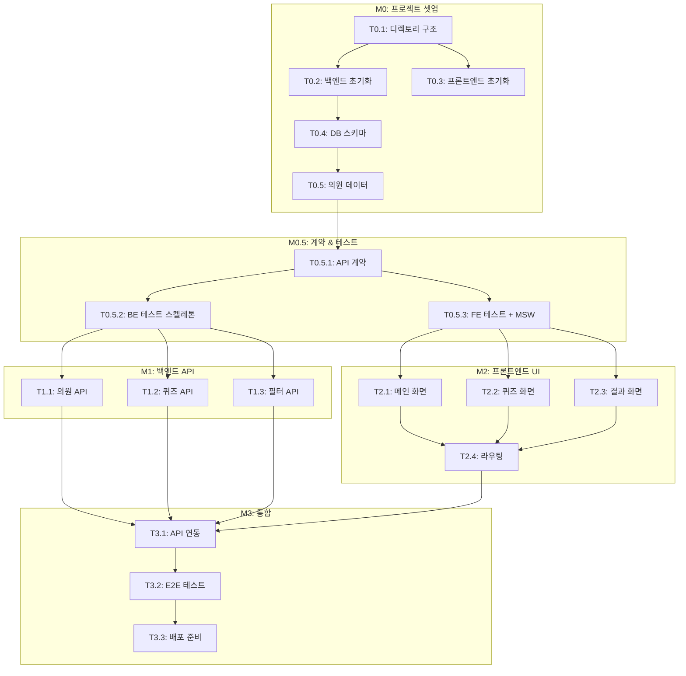

# TASKS: 의원얼굴퀴즈 - AI 개발 파트너용 태스크 목록

> 경기도의회 직원을 위한 의원 얼굴 학습 퀴즈 앱

---

## MVP 캡슐

| # | 항목 | 내용 |
|---|------|------|
| 1 | 목표 | 경기도의회 직원이 의원 얼굴과 이름을 쉽고 재미있게 학습 |
| 2 | 페르소나 | 경기도의회 사무처 직원 (특히 신규 입사자) |
| 3 | 핵심 기능 | FEAT-1: 얼굴 보고 이름 맞추기 퀴즈 |
| 4 | 성공 지표 (노스스타) | 사용자가 전체 의원 정답률 80% 이상 달성 |
| 5 | 입력 지표 | 퀴즈 완료 횟수, 일일 활성 사용자 |
| 6 | 비기능 요구 | 모바일/PC 반응형 지원 |
| 7 | Out-of-scope | 로그인/회원가입, 학습 진도 저장, 랭킹 시스템 |
| 8 | Top 리스크 | 의원 사진 데이터 확보 및 최신 유지 |
| 9 | 완화/실험 | 경기도의회 공식 홈페이지 데이터 활용 |
| 10 | 다음 단계 | 의원 데이터 수집 및 정리 |

---

## 기술 스택

| 구분 | 선택 |
|------|------|
| **백엔드** | FastAPI (Python 3.11+) |
| **프론트엔드** | React 18 + Vite + TypeScript |
| **스타일링** | TailwindCSS |
| **애니메이션** | Framer Motion |
| **데이터베이스** | SQLite + SQLAlchemy |
| **테스트** | pytest (BE) / Vitest + MSW (FE) / Playwright (E2E) |

---

## 마일스톤 개요

| 마일스톤 | 설명 | Phase | 태스크 수 |
|----------|------|-------|----------|
| M0 | 프로젝트 셋업 | Phase 0 | 5 |
| M0.5 | 계약 & 테스트 설계 | Phase 0 | 3 |
| M1 | 백엔드 API | Phase 1 | 3 |
| M2 | 프론트엔드 UI | Phase 2 | 4 |
| M3 | 통합 및 마무리 | Phase 3 | 3 |

---

## M0: 프로젝트 셋업

### [] Phase 0, T0.1: 프로젝트 디렉토리 구조 생성

**담당**: frontend-specialist

**작업 내용**:
- 전체 프로젝트 디렉토리 구조 생성
- README.md 작성
- .gitignore 설정

**산출물**:
```
member-quiz/
├── frontend/
├── backend/
├── contracts/
├── docs/planning/
├── .gitignore
└── README.md
```

**완료 조건**:
- [ ] 디렉토리 구조 생성됨
- [ ] .gitignore에 .env, node_modules, __pycache__, *.db 포함
- [ ] README.md에 프로젝트 개요 작성

---

### [] Phase 0, T0.2: 백엔드 프로젝트 초기화

**담당**: backend-specialist

**작업 내용**:
- FastAPI 프로젝트 셋업
- requirements.txt 작성
- 기본 앱 구조 생성

**산출물**:
```
backend/
├── app/
│   ├── __init__.py
│   ├── main.py
│   ├── models/
│   ├── routes/
│   ├── schemas/
│   ├── services/
│   └── database/
├── tests/
├── requirements.txt
└── .env.example
```

**requirements.txt**:
```
fastapi>=0.104.0
uvicorn[standard]>=0.24.0
sqlalchemy>=2.0.0
pydantic>=2.0.0
python-dotenv>=1.0.0
pytest>=7.4.0
pytest-asyncio>=0.21.0
httpx>=0.25.0
pytest-cov>=4.1.0
ruff>=0.1.0
```

**완료 조건**:
- [ ] `uvicorn app.main:app --reload` 실행 시 서버 시작됨
- [ ] `GET /` 응답: `{"message": "의원얼굴퀴즈 API"}`
- [ ] `GET /docs` Swagger UI 표시됨

---

### [] Phase 0, T0.3: 프론트엔드 프로젝트 초기화

**담당**: frontend-specialist

**작업 내용**:
- Vite + React + TypeScript 셋업
- TailwindCSS 설정
- Framer Motion 설치
- 기본 앱 구조 생성

**산출물**:
```
frontend/
├── src/
│   ├── components/
│   ├── pages/
│   ├── hooks/
│   ├── services/
│   ├── types/
│   ├── utils/
│   ├── mocks/
│   ├── __tests__/
│   ├── App.tsx
│   ├── main.tsx
│   └── index.css
├── public/
│   └── images/members/
├── e2e/
├── index.html
├── package.json
├── tailwind.config.js
├── tsconfig.json
└── vite.config.ts
```

**완료 조건**:
- [ ] `npm run dev` 실행 시 개발 서버 시작됨
- [ ] TailwindCSS 적용 확인
- [ ] TypeScript 타입 체크 통과

---

### [] Phase 0, T0.4: 데이터베이스 스키마 생성

**담당**: database-specialist

**작업 내용**:
- SQLAlchemy 모델 정의 (Member, District, Committee, MemberCommittee)
- 데이터베이스 초기화 스크립트
- 시드 데이터 스크립트 (샘플 데이터)

**산출물**:
- `backend/app/models/member.py`
- `backend/app/models/district.py`
- `backend/app/models/committee.py`
- `backend/app/database/database.py`
- `backend/data/seed.py`

**완료 조건**:
- [ ] 테이블 생성 스크립트 실행됨
- [ ] 샘플 데이터 5명 이상 삽입됨
- [ ] `SELECT * FROM members` 조회 성공

---

### [] Phase 0, T0.5: 의원 데이터 수집 및 시드

**담당**: database-specialist

**작업 내용**:
- 경기도의회 11대 의원 데이터 수집
- 의원 사진 다운로드 및 저장
- 전체 시드 데이터 생성

**산출물**:
- `backend/data/members.json` (전체 의원 데이터)
- `frontend/public/images/members/` (의원 사진)
- `backend/data/seed_full.py` (전체 시드 스크립트)

**데이터 구조**:
```json
{
  "members": [
    {
      "name": "홍길동",
      "photo_url": "/images/members/hong-gildong.jpg",
      "party": "더불어민주당",
      "district": "수원시갑",
      "committees": ["운영위원회", "기획재정위원회"]
    }
  ],
  "districts": [...],
  "committees": [...]
}
```

**완료 조건**:
- [ ] 의원 데이터 JSON 파일 생성됨
- [ ] 의원 사진 파일 저장됨 (최소 10명 샘플)
- [ ] 시드 스크립트 실행 시 DB에 데이터 삽입됨

---

## M0.5: 계약 & 테스트 설계

### [] Phase 0, T0.5.1: API 계약 정의

**담당**: backend-specialist

**작업 내용**:
- API 엔드포인트 계약 정의
- TypeScript 타입 정의 (프론트엔드용)
- Pydantic 스키마 정의 (백엔드용)

**산출물**:

**contracts/api.contract.ts**:
```typescript
// 의원 타입
export interface Member {
  id: number;
  name: string;
  photoUrl: string;
  party: string | null;
  districtId: number;
  districtName: string;
}

// 퀴즈 문제 타입
export interface QuizQuestion {
  member: Member;       // 정답 의원
  options: Member[];    // 4개 보기 (정답 포함)
}

// API 응답 타입
export interface ApiResponse<T> {
  data: T;
  meta?: { total?: number };
}

// API 엔드포인트
export const API = {
  members: {
    list: 'GET /api/members',          // 의원 목록
    detail: 'GET /api/members/:id',    // 의원 상세
  },
  quiz: {
    question: 'GET /api/quiz',          // 퀴즈 문제 생성
  },
  filters: {
    districts: 'GET /api/districts',    // 지역구 목록
    committees: 'GET /api/committees',  // 위원회 목록
  },
};
```

**backend/app/schemas/member.py**:
```python
from pydantic import BaseModel

class MemberBase(BaseModel):
    name: str
    photo_url: str
    party: str | None = None
    district_id: int

class MemberResponse(MemberBase):
    id: int
    district_name: str

    class Config:
        from_attributes = True

class QuizQuestionResponse(BaseModel):
    member: MemberResponse
    options: list[MemberResponse]
```

**완료 조건**:
- [ ] contracts/api.contract.ts 생성됨
- [ ] backend/app/schemas/*.py 생성됨
- [ ] TypeScript 타입과 Pydantic 스키마 동기화됨

---

### [] Phase 0, T0.5.2: 백엔드 테스트 스켈레톤

**담당**: test-specialist

**작업 내용**:
- pytest 설정
- API 테스트 스켈레톤 작성 (실패 상태)
- 테스트 실행 확인

**산출물**:
- `backend/tests/conftest.py` (pytest 설정)
- `backend/tests/api/test_members.py`
- `backend/tests/api/test_quiz.py`
- `backend/tests/api/test_filters.py`

**테스트 예시** (RED 상태):
```python
# tests/api/test_members.py
import pytest
from httpx import AsyncClient

@pytest.mark.asyncio
async def test_get_members_list(client: AsyncClient):
    """의원 목록 조회 테스트"""
    response = await client.get("/api/members")
    assert response.status_code == 200
    data = response.json()
    assert "data" in data
    assert isinstance(data["data"], list)

@pytest.mark.asyncio
async def test_get_members_filter_by_district(client: AsyncClient):
    """지역구별 의원 필터링 테스트"""
    response = await client.get("/api/members?district_id=1")
    assert response.status_code == 200
    # 모든 의원이 해당 지역구 소속인지 확인
```

**완료 조건**:
- [ ] `pytest tests/ -v` 실행 시 테스트 발견됨
- [ ] 모든 테스트 FAILED 상태 (RED) - 정상!
- [ ] 테스트 케이스 10개 이상 작성됨

---

### [] Phase 0, T0.5.3: 프론트엔드 테스트 스켈레톤 + MSW 목

**담당**: test-specialist

**작업 내용**:
- Vitest 설정
- MSW (Mock Service Worker) 설정
- 컴포넌트 테스트 스켈레톤 작성 (실패 상태)

**산출물**:
- `frontend/src/mocks/handlers/members.ts`
- `frontend/src/mocks/handlers/quiz.ts`
- `frontend/src/mocks/browser.ts`
- `frontend/src/__tests__/components/QuizCard.test.tsx`
- `frontend/src/__tests__/pages/QuizPage.test.tsx`

**MSW 핸들러 예시**:
```typescript
// src/mocks/handlers/members.ts
import { http, HttpResponse } from 'msw';
import { mockMembers } from '../data/members';

export const memberHandlers = [
  http.get('/api/members', () => {
    return HttpResponse.json({
      data: mockMembers,
      meta: { total: mockMembers.length },
    });
  }),
];
```

**테스트 예시** (RED 상태):
```typescript
// src/__tests__/components/QuizCard.test.tsx
import { render, screen } from '@testing-library/react';
import { QuizCard } from '@/components/quiz/QuizCard';

describe('QuizCard', () => {
  it('의원 사진을 표시한다', () => {
    render(<QuizCard member={mockMember} options={mockOptions} onAnswer={vi.fn()} />);
    expect(screen.getByRole('img')).toBeInTheDocument();
  });

  it('4개의 보기 버튼을 표시한다', () => {
    render(<QuizCard member={mockMember} options={mockOptions} onAnswer={vi.fn()} />);
    expect(screen.getAllByRole('button')).toHaveLength(4);
  });
});
```

**완료 조건**:
- [ ] `npm run test` 실행 시 테스트 발견됨
- [ ] 모든 테스트 FAILED 상태 (RED) - 정상!
- [ ] MSW 핸들러로 API 모킹됨

---

## M1: 백엔드 API

### [] Phase 1, T1.1: 의원 목록/상세 API RED→GREEN

**담당**: backend-specialist

**Git Worktree 설정**:
```bash
# 1. Worktree 생성
git worktree add ../member-quiz-phase1-api -b phase/1-members-api
cd ../member-quiz-phase1-api

# 2. 작업 완료 후 병합 (사용자 승인 필요)
# git checkout main
# git merge phase/1-members-api
# git worktree remove ../member-quiz-phase1-api
```

**TDD 사이클**:

1. **RED**: 테스트 작성 (실패 확인)
   ```bash
   # 테스트 파일: tests/api/test_members.py
   cd backend
   pytest tests/api/test_members.py -v  # Expected: FAILED
   ```

2. **GREEN**: 최소 구현 (테스트 통과)
   ```bash
   # 구현 파일:
   # - app/routes/members.py
   # - app/services/member_service.py
   pytest tests/api/test_members.py -v  # Expected: PASSED
   ```

3. **REFACTOR**: 리팩토링 (테스트 유지)
   - 코드 정리
   - 중복 제거
   - 테스트 계속 통과 확인

**API 엔드포인트**:
- `GET /api/members` - 의원 목록 (필터링 지원)
- `GET /api/members/{id}` - 의원 상세

**산출물**:
- `backend/tests/api/test_members.py` (테스트)
- `backend/app/routes/members.py` (라우트)
- `backend/app/services/member_service.py` (서비스)

**인수 조건**:
- [ ] 테스트 먼저 작성됨 (RED 확인)
- [ ] 모든 테스트 통과 (GREEN)
- [ ] 커버리지 >= 80%
- [ ] `GET /api/members` 200 응답
- [ ] `GET /api/members?district_id=1` 필터링 동작
- [ ] `GET /api/members?committee_id=1` 필터링 동작

**완료 시**:
- [ ] 사용자 승인 후 main 브랜치에 병합
- [ ] worktree 정리: `git worktree remove ../member-quiz-phase1-api`

---

### [] Phase 1, T1.2: 퀴즈 API RED→GREEN

**담당**: backend-specialist

**Git Worktree 설정**:
```bash
git worktree add ../member-quiz-phase1-quiz -b phase/1-quiz-api
cd ../member-quiz-phase1-quiz
```

**TDD 사이클**:

1. **RED**: 테스트 작성 (실패 확인)
   ```bash
   # 테스트 파일: tests/api/test_quiz.py
   pytest tests/api/test_quiz.py -v  # Expected: FAILED
   ```

2. **GREEN**: 최소 구현 (테스트 통과)
   ```bash
   # 구현 파일:
   # - app/routes/quiz.py
   # - app/services/quiz_service.py
   pytest tests/api/test_quiz.py -v  # Expected: PASSED
   ```

3. **REFACTOR**: 리팩토링

**API 엔드포인트**:
- `GET /api/quiz` - 퀴즈 문제 생성 (랜덤 4지선다)
- `GET /api/quiz?district_id=1` - 지역구 필터 퀴즈
- `GET /api/quiz?committee_id=1` - 위원회 필터 퀴즈

**퀴즈 로직**:
```python
def generate_quiz_question(db: Session, district_id: int | None = None) -> QuizQuestion:
    # 1. 정답 의원 랜덤 선택
    answer = random_member(db, district_id)

    # 2. 오답 의원 3명 선택 (정답 제외)
    wrong_answers = random_members(db, exclude_id=answer.id, count=3)

    # 3. 4개 보기 섞기
    options = shuffle([answer] + wrong_answers)

    return QuizQuestion(member=answer, options=options)
```

**산출물**:
- `backend/tests/api/test_quiz.py` (테스트)
- `backend/app/routes/quiz.py` (라우트)
- `backend/app/services/quiz_service.py` (서비스)

**인수 조건**:
- [ ] 테스트 먼저 작성됨 (RED 확인)
- [ ] 모든 테스트 통과 (GREEN)
- [ ] 커버리지 >= 80%
- [ ] 응답에 정답 의원 + 4개 보기 포함
- [ ] 매 요청마다 다른 문제 생성됨
- [ ] 필터링 동작 확인

**완료 시**:
- [ ] 사용자 승인 후 main 브랜치에 병합
- [ ] worktree 정리

---

### [] Phase 1, T1.3: 필터 API RED→GREEN

**담당**: backend-specialist

**Git Worktree 설정**:
```bash
git worktree add ../member-quiz-phase1-filters -b phase/1-filters-api
cd ../member-quiz-phase1-filters
```

**TDD 사이클**:

1. **RED**: 테스트 작성
   ```bash
   pytest tests/api/test_filters.py -v  # Expected: FAILED
   ```

2. **GREEN**: 구현
   ```bash
   pytest tests/api/test_filters.py -v  # Expected: PASSED
   ```

**API 엔드포인트**:
- `GET /api/districts` - 지역구 목록
- `GET /api/committees` - 위원회 목록

**산출물**:
- `backend/tests/api/test_filters.py` (테스트)
- `backend/app/routes/filters.py` (라우트)

**인수 조건**:
- [ ] 테스트 먼저 작성됨 (RED 확인)
- [ ] 모든 테스트 통과 (GREEN)
- [ ] 지역구/위원회 목록 정상 응답

**완료 시**:
- [ ] 사용자 승인 후 main 브랜치에 병합

---

## M2: 프론트엔드 UI

### [] Phase 2, T2.1: 메인 화면 컴포넌트 RED→GREEN

**담당**: frontend-specialist

**의존성**: T0.5.3 (MSW 목) - **Mock 사용으로 독립 개발 가능**

**Git Worktree 설정**:
```bash
git worktree add ../member-quiz-phase2-main -b phase/2-main-page
cd ../member-quiz-phase2-main
```

**TDD 사이클**:

1. **RED**: 테스트 작성
   ```bash
   npm run test -- src/__tests__/pages/MainPage.test.tsx
   # Expected: FAILED
   ```

2. **GREEN**: 구현
   ```bash
   npm run test -- src/__tests__/pages/MainPage.test.tsx
   # Expected: PASSED
   ```

**컴포넌트 구조**:
```
src/pages/MainPage.tsx
src/components/common/Button.tsx
src/components/common/FilterDropdown.tsx
```

**화면 요구사항**:
- 앱 타이틀 표시
- "전체 퀴즈 시작" 버튼
- 지역구 필터 드롭다운
- 위원회 필터 드롭다운
- "선택 퀴즈 시작" 버튼

**산출물**:
- `frontend/src/__tests__/pages/MainPage.test.tsx` (테스트)
- `frontend/src/pages/MainPage.tsx` (페이지)
- `frontend/src/components/common/Button.tsx` (버튼)
- `frontend/src/components/common/FilterDropdown.tsx` (드롭다운)

**인수 조건**:
- [ ] 테스트 먼저 작성됨 (RED 확인)
- [ ] 모든 테스트 통과 (GREEN)
- [ ] 반응형 레이아웃 (모바일/PC)
- [ ] 필터 선택 시 상태 저장됨

**완료 시**:
- [ ] 사용자 승인 후 main 브랜치에 병합

---

### [] Phase 2, T2.2: 퀴즈 화면 컴포넌트 RED→GREEN

**담당**: frontend-specialist

**의존성**: T0.5.3 (MSW 목) - **Mock 사용으로 독립 개발 가능**

**Git Worktree 설정**:
```bash
git worktree add ../member-quiz-phase2-quiz -b phase/2-quiz-page
cd ../member-quiz-phase2-quiz
```

**TDD 사이클**:

1. **RED**: 테스트 작성
   ```bash
   npm run test -- src/__tests__/pages/QuizPage.test.tsx
   npm run test -- src/__tests__/components/QuizCard.test.tsx
   ```

2. **GREEN**: 구현

**컴포넌트 구조**:
```
src/pages/QuizPage.tsx
src/components/quiz/QuizCard.tsx
src/components/quiz/AnswerOption.tsx
src/components/quiz/ProgressBar.tsx
src/hooks/useQuiz.ts
```

**화면 요구사항**:
- 문제 번호 표시 (1/10)
- 의원 사진 (원형, 200px)
- "이 의원의 이름은?" 질문
- 4개 보기 버튼 (칼라풀)
- 진행률 바
- 정답/오답 애니메이션 (Framer Motion)
- 오답 시 정답 의원 정보 표시

**산출물**:
- `frontend/src/__tests__/pages/QuizPage.test.tsx`
- `frontend/src/__tests__/components/QuizCard.test.tsx`
- `frontend/src/pages/QuizPage.tsx`
- `frontend/src/components/quiz/*.tsx`
- `frontend/src/hooks/useQuiz.ts`

**인수 조건**:
- [ ] 테스트 먼저 작성됨 (RED 확인)
- [ ] 모든 테스트 통과 (GREEN)
- [ ] 정답 시 초록색 + 바운스 애니메이션
- [ ] 오답 시 빨간색 + 쉐이크 애니메이션
- [ ] 10문제 후 결과 화면으로 이동

**완료 시**:
- [ ] 사용자 승인 후 main 브랜치에 병합

---

### [] Phase 2, T2.3: 결과 화면 컴포넌트 RED→GREEN

**담당**: frontend-specialist

**Git Worktree 설정**:
```bash
git worktree add ../member-quiz-phase2-result -b phase/2-result-page
cd ../member-quiz-phase2-result
```

**TDD 사이클**:

1. **RED**: 테스트 작성
   ```bash
   npm run test -- src/__tests__/pages/ResultPage.test.tsx
   ```

2. **GREEN**: 구현

**화면 요구사항**:
- 점수 표시 (X / 10)
- 정답률 % 표시
- 응원 메시지 (80% 이상: "훌륭합니다!", 미만: "더 연습해보세요!")
- "다시 도전" 버튼
- "메인으로" 버튼

**산출물**:
- `frontend/src/__tests__/pages/ResultPage.test.tsx`
- `frontend/src/pages/ResultPage.tsx`

**인수 조건**:
- [ ] 테스트 먼저 작성됨 (RED 확인)
- [ ] 모든 테스트 통과 (GREEN)
- [ ] 점수에 따른 메시지 분기 동작

**완료 시**:
- [ ] 사용자 승인 후 main 브랜치에 병합

---

### [] Phase 2, T2.4: 라우팅 및 상태 연결 RED→GREEN

**담당**: frontend-specialist

**Git Worktree 설정**:
```bash
git worktree add ../member-quiz-phase2-routing -b phase/2-routing
cd ../member-quiz-phase2-routing
```

**작업 내용**:
- React Router 설정
- 페이지 간 상태 전달
- 필터 상태 관리

**라우트 구조**:
```
/ → MainPage
/quiz → QuizPage
/result → ResultPage
```

**산출물**:
- `frontend/src/App.tsx` (라우팅)
- `frontend/src/routes.tsx` (라우트 정의)

**인수 조건**:
- [ ] 페이지 간 이동 동작
- [ ] 필터 상태 퀴즈 페이지로 전달됨
- [ ] 점수 결과 페이지로 전달됨

**완료 시**:
- [ ] 사용자 승인 후 main 브랜치에 병합

---

## M3: 통합 및 마무리

### [] Phase 3, T3.1: API 연동 (Mock 제거)

**담당**: frontend-specialist

**Git Worktree 설정**:
```bash
git worktree add ../member-quiz-phase3-integration -b phase/3-api-integration
cd ../member-quiz-phase3-integration
```

**작업 내용**:
- MSW Mock 제거 (개발 모드 제외)
- 실제 API 연동
- API 서비스 레이어 구현

**산출물**:
- `frontend/src/services/api.ts` (API 클라이언트)
- `frontend/src/services/memberService.ts`
- `frontend/src/services/quizService.ts`

**인수 조건**:
- [ ] 백엔드 API와 연동 동작
- [ ] 에러 처리 구현 (네트워크 오류 등)
- [ ] 로딩 상태 표시

**완료 시**:
- [ ] 사용자 승인 후 main 브랜치에 병합

---

### [] Phase 3, T3.2: E2E 테스트

**담당**: test-specialist

**Git Worktree 설정**:
```bash
git worktree add ../member-quiz-phase3-e2e -b phase/3-e2e
cd ../member-quiz-phase3-e2e
```

**작업 내용**:
- Playwright 설정
- 핵심 유저 플로우 E2E 테스트

**테스트 시나리오**:
1. 메인 화면 → 퀴즈 시작 → 10문제 풀기 → 결과 확인
2. 필터 선택 → 필터링된 퀴즈 풀기
3. 오답 시 정답 정보 표시 확인

**산출물**:
- `frontend/e2e/quiz-flow.spec.ts`
- `frontend/playwright.config.ts`

**인수 조건**:
- [ ] E2E 테스트 모두 통과
- [ ] CI에서 실행 가능

**완료 시**:
- [ ] 사용자 승인 후 main 브랜치에 병합

---

### [] Phase 3, T3.3: 배포 준비

**담당**: frontend-specialist

**작업 내용**:
- 프로덕션 빌드 확인
- 환경 변수 설정
- CORS 설정 확인
- README 업데이트

**산출물**:
- `frontend/.env.production`
- `backend/.env.production`
- 업데이트된 `README.md`

**인수 조건**:
- [ ] `npm run build` 성공
- [ ] 프로덕션 빌드 테스트 동작
- [ ] 배포 가이드 문서화

---

## 의존성 그래프



---

## 병렬 실행 가능 태스크

| 그룹 | 태스크 | 설명 |
|------|--------|------|
| A | T0.2, T0.3 | 백엔드/프론트엔드 초기화 동시 진행 |
| B | T0.5.2, T0.5.3 | BE/FE 테스트 스켈레톤 동시 작성 |
| C | T1.1, T1.2, T1.3 | 백엔드 API 병렬 개발 (각각 독립) |
| D | T2.1, T2.2, T2.3 | 프론트엔드 UI 병렬 개발 (MSW로 독립) |

---

## 완료 체크리스트

- [ ] **M0**: 프로젝트 구조 완성, 개발 환경 동작
- [ ] **M0.5**: API 계약 정의, 테스트 스켈레톤 (RED)
- [ ] **M1**: 모든 백엔드 API 동작, 테스트 통과 (GREEN)
- [ ] **M2**: 모든 UI 컴포넌트 동작, 테스트 통과 (GREEN)
- [ ] **M3**: 통합 완료, E2E 통과, 배포 준비 완료

---

## Decision Log

| 결정 | 이유 |
|------|------|
| 10문제 1세트 | 짧은 시간에 완료 가능 |
| Phase별 Git Worktree | BE/FE 병렬 개발, 충돌 방지 |
| MSW 사용 | FE 독립 개발 가능 |
| TDD 사이클 | 안정적인 코드, 명확한 완료 기준 |
